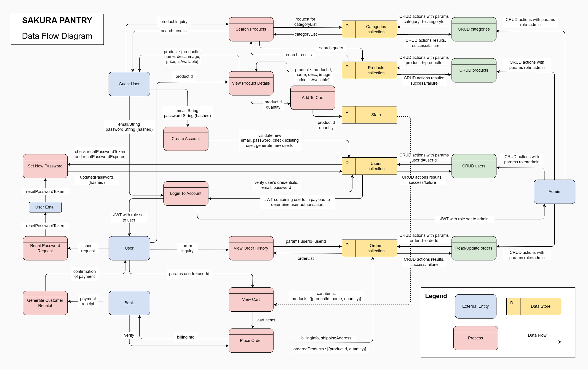

# T3A2 Full Stack App

# Sakura Pantry - Japanese Online Grocery Store

## Resources

- [Production site](https://www.google.com.au/)
- [Back-end repo](https://github.com/irene2mana-T3A2-2023/SakuraPantryServer)
- [Front-end repo](https://github.com/irene2mana-T3A2-2023/SakuraPantryClient)
- [Trello board](https://trello.com/b/TE5Q9ZYj/t3a2-%F0%9F%8C%B8sakura-pantry)

## Contributors

- [Mana Misumi](https://github.com/Mana12011207)
- [Irene Nguyen](https://github.com/irenenguyen1017)
- [Ellen Pham](https://github.com/ellenpham)

# R1 - Website description

## Purpose

We were approached by the owner of Sakura Company, a Japanese food wholesaler, to develop an online store for selling authentic Japanese food products.

The web app serves three primary objectives:

- To enhance the promotion and accessibility of Japanese cuisine.
- To provide an additional shopping channel to the Japanese community in Australia and to those who love Japanese food products.
- To expand the market and promote sales growth for the client - Sakura Company.

### Problem

Before the website's launch, the main source of Japanese food was supermarkets predominantly situated in central areas, presenting geographical limitations for suburban residents. Additionally, the restricted number of stores and early closing times, typically around 5 pm, posed challenges for full-time workers to access these stores. While Sakura Company currently sells its products through distribution to Asian grocery stores, this traditional approach faces challenges as the market experiences a saturation of new products from various countries introduced in recent years, resulting in stagnant consumption growth. In addition, establishing a brick-and-mortar store posed a considerable challenge for Sakura Company, particularly given the increased rental costs stemming from recent unforeseen inflation.

### Solution

The introduction of Sakura Pantry aims to effectively tackle these challenges. Sakura Pantry stands as a user-friendly platform for purchasing Japanese food products, catering to both urban and suburban residents and operating 24/7. Unconstrained by the limitations of physical stores, it provides the convenience of online shopping, especially beneficial for the busy full-time workforce. Offering an omnichannel shopping experience, Sakura Pantry becomes an additional avenue for Sakura Company to reach a broader customer base, promoting market expansion and driving sales growth. In this way, Sakura Pantry presents a contemporary solution that meets the growing demand, enhancing accessibility to Japanese food ingredients.

### Project goals

The primary goal of the project is to design and launch a full-stack web application utilizing MERN stack, featuring a fully developed MVP with the aim of understanding customers behaviours and interest in the initial phase of development. This encompasses:

- An intuitive and responsive front-end, enabling users to seamlessly browse and search.
- A fully functional back-end API which allows users to register/login, add items to cart and checkout.
- An internal system for the administrators to efficiently manage elements and activities that are involved in the website's operation.

## Functionality/Features

The overall function of the website is to operate as an online store for selling Japanese food products. Below are the MVP features and functionality for the current stage of product development.

### MVP Features

- User authentication and authorisation (Register and Login)
  - Allow users to create account and login.
- Password recovery
  - Allow users to reset password with reset link sent via email.
- Site navigation and responsive design
  - Intuitive and responsive UX/UI design for storefront to attract and engage audience.
- Search functionality
  - Allow users to search products by keywords.
- Product catalogue
  - Showcase of new arrivals and featured products.
  - Display a list of products when filtered by categories.
- Product details
  - Detailed information about each product, including product descriptions and product stock status.
- Shopping cart
  - Allow users to add products to cart, view items in cart and increase, decrease or remove items from cart.
- Checkout process
  - Allow users to fill out details of delivery and billing information.
- Contact form
  - Allow users to send their enquiries.
- User account view
  - View user profile
  - Change password
  - View order history
- Admin dashboard:
  - Summary view: allow admins to view total users, total products, total orders and total revenue.
  - User management
  - Category management
  - Product management
  - Order management

### MVP Functionality

#### Users

- Guest users without authentication can view products.
- Guest users can add products to cart and will be prompted to register or log in if they wish to proceed to payment.
- Guest users without authentication can Create account to become authenticated users.
- Users with authentication can perform Read operation on their personal account information.
- Users with authentication can perform Create, Read operations on product orders.

#### Admins

- Admins can perform Read operation on user account details.
- Admins can perform CRUD operations on products data.
- Admins can perform CRUD operations on categories data.
- Admins can perform Read and Update operations on orders. The deletion operation is restricted since orders data must be retained in the system for historical reference. Instead, orders can be marked as cancelled or archived.

### Possible extensions

#### Nice-to-have features

- Sign-up confirmation via email
- Saved login details
- Secure logout
- Calculation for different delivery options
- Billing services/Payment integration
- Order confirmation via email

#### Nice-to-have functionality

- Update and Deactivate operations on user account details for users with authentication.
- Update and Deactivate operations on user account details for admins.

## Target Audience

The app targets shoppers across Australia who are looking for unique and quality Japanese food products, including:

- Japanese people residing in Australia
- Japanese food products lovers

## Tech Stack

The core tech stack is MERN stack.

- Application:
  - Back-end API: NodeJS, ExpressJS, Mongoose
  - Front-end: HTML, CSS, JavaScript, ReactJS, Axios, Tailwind, NextUI
- Database:
  - MongoDB, MongoDB Atlas
- Testing:
  - Jest, Supertest
- Deployment:
  - Back-end API: Heroku
  - Front-end: Netlify
- DevOps:
  - Git
  - GitHub
  - VS Code
- Project Management:
  - Trello
  - Discord
  - Skype
- Design Tools:
  - Draw.io
  - Miro

# R2 - Dataflow Diagram and Sitemap

## Website Sitemap


## Dataflow Diagram



### Data description

```
Users:
_id
firstName: String
lastName: String
email: String
password: String (hashed)
phone: String
role: String
isActive: Boolean
dateCreated: Date
resetPasswordToken: String (encrypted)
resetPasswordExpires: Boolean
address: {street: String, city: String, state: String, postcode: String}

Products:
_id
name: String
description: String
price: String
categoryId: referencing _id from Categories collection
stockQuantity: Number
image: String (URL)
isAvailable: Boolean
productSlug: String

Categories:
_id
name: String
categorySlug: String

Orders:
_id
userId: referencing _id from Users collection
orderedProducts: [{productId: referencing _id from Products, quantity: Number}]
totalPrice: Number
orderDate: Date
status: String
billingInfo:{cardholder:String, accountNumber:String, CVV:String}
shippingAddress:{street: String, city: String, state: String, postcode: String}
```

# R3 - Application Architecture Diagram


# R4 - User Stories
We constructed user stories and personas to improve the online store's user experience for Japanese food products. The process involves identifying and embodying customers' unique needs and expectations, including a system administrator at Sakura company.

## Initial Market Research

1. As a guest user, I want to search for products using keywords to quickly find items of interest.

2. As a guest user, I would like to view featured collections showcasing popular items.

3. As a guest user, I want to add products to my shopping cart so that I can review and proceed to checkout.

4. As a guest user, I want a streamlined checkout process with clear steps to provide shipping information, select payment options, and place my order.

5. As a guest user, I want a navigation bar on the online shop. The navigation bar allows me to explore the entire site efficiently and provides easy access to site contents.

6. As a guest user, I want to register for an account on an e-commerce website so that I can track my orders, benefit from personalized features, and experience a seamless and tailored shopping journey. 

7. As a registered user, I want to log in to my account with my credentials to securely access personalized features and make purchases.

8. As a registered user, I want to view my order history to track previous purchases and check the status of current orders.

9. As an administrator, I want users to register and log in for the payment process, providing a personalized experience while ensuring the integrity and confidentiality of their accounts and data. 

10. As an administrator, I want to compile a concise summary of store data to guide our development strategy, ensuring optimal alignment of resources with our business growth.

## User Personas

In order to gain deeper insights into our target audience, we developed user personas to delve into the goals and needs of our targeted users. The following details were compiled after consulting with the target audience regarding their objectives and experiences in pursuit of those goals.

**Shizuka represents Japanese people residing in Australia**


1. As Shizuka, I want a customizable shopping cart feature on the online shop. This feature enables me to efficiently manage multiple products in my cart, allowing me to adjust quantities and remove items as needed.

2. As Shizuka, I want a 24/7 accessible contact form on the online shop, enabling me to swiftly inquire about products and services at any time and from any location.

3. As Shizuka, I want a search feature with category filtering options to streamline the process of finding the right product and save valuable time.

**Ronnie represents non-Japanese people who loves Japanese food products**


4. As Ronnie, a person who enjoys discovering new items, I want a 'New Arrivals' section to provide me with fresh suggestions on Japanese products that I might find appealing.

5. As Ronnie, I want an intuitive platform that allows me to enjoy exploring the diverse range of ingredients and products exclusive to Japan.

6. As Ronnie, a non-Japanese user in need of assistance with the Japanese language, I want a website where products are translated into English, facilitating a better understanding of product details.

**Jinny represents users who enjoy internet browsing for recipes and food ingredients.**


7. As Jinny, a person who primarily accesses websites through smartphone for product searches and information browsing, I want a website with responsive design. A responsive design ensures that the information is organized and intuitive, eliminating the need for excessive scrolling or zooming on my mobile device.

8. As Jinny, a cooking enthusiast, I want a list of recommended products for diverse and delicious recipes, enhancing my culinary experiences and inspiring creativity in the kitchen.

**Lara represents the administrators of the website**


9. As Lara, I want the ability to perform CRUD operations on products and product categories, which will enable me to manage product inventory efficiently and maintain accurate stock listings.

10. As Lara, I want the ability to read and update customer orders. This feature empowers me to access detailed order information, track order status and efficiently address any issues or inquiries from customers.

## Follow-up Market (nice to have)

After further revision, we have developed additional user stories based on both general users and targeted users to plan for more advanced nice-to-have features that aim to enhance user experience, as outlined below:

1. As a registered user, I want to receive a confirmation email upon completing the sign-up process, providing an added layer of security against unauthorized access to my account.

2. As a registered user, I want the option to save my login credentials for convenient and swift access to my account.

3. As a registered user, I want order confirmation emails for a detailed record of my past purchases, making it easy to reference for future transactions.

4. As a registered user, I want the ability to choose from various delivery options. This allows me to compare and select the most suitable option based on factors such as delivery time and price.

5. As a parent, I want a secure logout feature to prevent accidental purchases by children and ensure the security of my account.

6. As a user who frequently changes residence, I want an easy-to-use profile update feature to ensure accurate delivery information despite my frequent changes in address.

7. As an administrator, I want the ability to efficiently manage users by performing CRUD operations on their information and assisting with account-related matters.

# R5 - Wireframes

Miro was used to design and plan wireframes for features of the application. Our web application adopts a consistent structure across all pages, which is divided into three main parts: the header, the body, and the footer.

## Page structure overview

**Header** is a persistent component that appears at the top of every page. It contains the following elements:

- **Logo**: Our company logo is placed prominently in the header, typically in the top left corner. Clicking the logo will always redirect users to the homepage.
- **Search bar**: Central to the header is a search bar that allows users to search for products by entering keywords. Additionally, users have the option to filter their search by categories to refine their results.
- **Sign in/Sign up Links**: To the right of the search bar, users can find links to 'sign-in' or 'sign-up'. These are provided for easy navigation to authentication pages for user account management.
- **Cart Icon**: An icon representing the shopping cart is also present. This icon displays a count of the number of products currently in the user's cart, offering users a quick view of their potential purchases.

**Body** is the central part of each page and is dynamic. Its layout and content will change to align with the specific purpose of the page. For instance, the body on the product details page will contain images and descriptions of products, while on the checkout page, it will display a form for payment information.

**Footer**, like the header, is a static component displayed at the bottom of every page (except the admin dashboard page). It typically contains company information, a contact form, and direct links to the company's social media profiles, such as Facebook and Instagram.

## Wireframe Breakpoint Range

In the context of responsive design, our project utilizes a set of predefined breakpoints to ensure optimal display across various devices. These breakpoints are crucial for the wireframe part of the project as they guide the layout and scaling of content.

- **Desktop screens**: Defined as screens with a width of `1024 pixels or greater`. Our design is tailored to accommodate a wide range of desktop displays, ensuring full functionality and aesthetic integrity on larger screens.
- **Tablet screens**: These are screens that fall `within the range of 768 pixels to 1023 pixels wide`. The design adjusts between these widths to provide a user-friendly experience on tablet devices, balancing touch interaction with readability.
- **Mobile screens**: Classified as any screen with a width of `less than 768 pixels`. Our mobile design prioritizes accessibility and navigability, recognizing the constraints and advantages of smaller touch screens.

For an in-depth look at our wireframe designs, please see the [Wireframe](https://miro.com/app/board/uXjVNNmFIuE=/)

### Homepage

The homepage includes a hero banner, a section for new arrivals, and a section for featured products, all with a sliding effect for seamless responsive design. The layout is minimal yet effective, enabling easy navigation and enhancing the shopping experience from the first interaction.


### Sign-in page

The Sign-in page is accessible to all visitors, allowing them to log into the website. Additionally, this page offers links that guide new users to the Sign-up page and provides a redirect to the Forgot Password page for users who need to recover their login credentials.


### Sign up page

The Sign-up page enables new visitors to create an account and includes a link for existing users to return to the Sign-in page.


### Forgot password page

Users will be directed to the Forgot Password page after clicking the 'Forgot Password' link. They are required to enter their email address and click the 'Send' button to receive a link for resetting their password.


### Reset password page

Upon clicking the reset password link received via email, users will be prompted to a page where they can establish a new password.


### Search page

The search bar allows users to search for products using keywords or filter products by categories using the drop-down menu. The matching results will be displayed on the search results page.


### Product details page

Clicking on a product image or name will direct users to the Product Details page, where they can find more information about the product, view the stock quantity, and increase or decrease the number of items before adding it to their cart


### Shopping cart page

When users click the cart icon in the header, they will be prompted to the Cart page. Here, they can view all the products they have added and can choose to proceed with their purchase by clicking the 'Proceed to checkout' button or continue shopping by clicking the 'Continue shopping' button.


### Checkout page

Users intent on proceeding to payment must log in or register an account to be taken to the Checkout page after selecting the 'Proceed to Checkout' button on the cart page. They are required to provide delivery address details and credit card information, and must review and confirm the order summary to finalize the payment process.


### User account page

Authenticated users have access to their personal accounts where they can view their profiles and purchase history. Additionally, they have the option to change their current password in this section.


### Admin dashboard page

The admin dashboard has four pages, which are structured as tabs:

- **Summary**: This tab provides an overview of the business's key metrics, such as the total number of products, orders, and registered users, all consolidated on a single summary screen.
- **Products**: This crucial section is the heart of product management within the admin dashboard, and the admin has the authority to view the entire list of products, add new products, edit existing product details, or remove products from the listing.
- **Categories**: Similar to the Products tab, this section empowers the admin to manage product categories. Here, the admin can view all existing categories, add new categories, update information on current categories, or remove categories as needed. This ensures that the product catalogue remains well-organized and easy to navigate.
- **Users**: This tab enables the admin to review the list of all registered users on the platform.
- **Orders**: In this section, the admin is able to overview the list of all orders, and update the status of these orders.


# R6 - Tasks planning and tracking

View the description of the way tasks are allocated and tracked in the project [here](./task_tracking.md).

Link to project management tool [Trello](https://trello.com/b/TE5Q9ZYj/t3a2-%F0%9F%8C%B8sakura-pantry).
