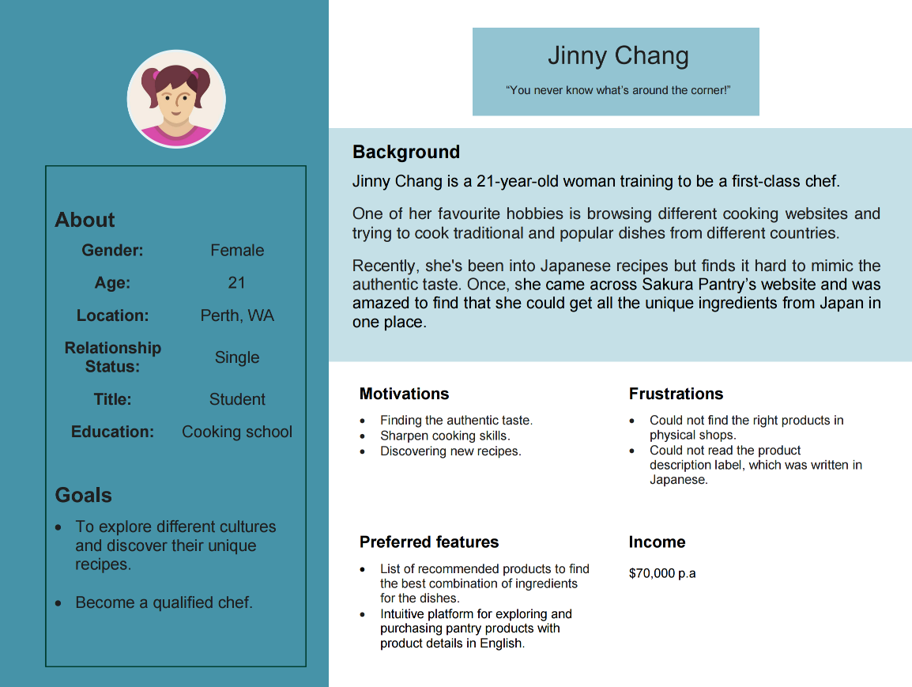

# T3A2 Full Stack App

# Sakura Pantry - Japanese Online Grocery Store

## Resources

- [Production site](https://www.google.com.au/)
- [Back-end repo](https://www.google.com.au/)
- [Front-end repo](https://www.google.com.au/)
- [Documentation repo](https://www.google.com.au/)
- [Trello board](https://trello.com/b/TE5Q9ZYj/t3a2-%F0%9F%8C%B8sakura-pantry)

## Contributors

- [Mana Misumi](https://github.com/Mana12011207)
- [Irene Nguyen](https://github.com/irenenguyen1017)
- [Ellen Pham](https://github.com/ellenpham)

# R1 - Website description

## Purpose

We were approached by the owner of Sakura Company, a Japanese food wholesaler, to create an online store for Japanese food products.

The web app serves three main purposes:

- To promote and increase access to Japanese food.
- To provide a service to the Japanese community in Australia and to those who love Japanese food products.
- To contribute to business and sales growth for the client, Sakura Company.

### Problem

Prior to having the website, the primary means of obtaining Japanese food was through Japanese supermarkets, mainly located in central areas. This posed geographical constraints for those living in the suburbs. Moreover, limited store numbers and early closing times, often by 5pm, made it challenging for full-time workers to visit. Setting up a physical shop also presented a significant hurdle for Sakura Company, especially with rising rents due to recent unforeseen inflation.

### Solution

The launch of Sakura Pantry is envisioned to address these challenges. Sakura Pantry is an easy-to-use platform for purchasing Japanese food products, accessible to both city dwellers and those in the suburbs, operating 24/7. Unrestricted by the number of shops or closing times, it offers the convenience of online shopping, catering to the busy full-time workforce. By avoiding the need for physical shops, it provides a more cost-efficient means for Sakura Company to offer Japanese food products. In doing so, Sakura Pantry introduces a modern solution to access Japanese food ingredients in response to contemporary demands.

## Functionality/Features

The overall function of the website is to operate as an online store for selling Japanese food products. Below are the MVP features and functionality for the current stage of product development.

### MVP Features

- User authentication and authorisation (Register and Login)
  - Allow users to create account and login.
- Password recovery
  - Allow users to reset password with reset link sent via email.
- Site navigation and responsive design
  - Intuitive and responsive UX/UI design for storefront to attract and engage audience.  
- Search functionality
  - Allow users to search products by keywords.
- Product catalogue
  - Showcase of new arrivals and featured products.
  - Display a list of products when filtered by categories.
- Product details
  - Detailed information about each product, including product descriptions and product stock status.
- Shopping cart
  - Allow users to add products to cart, view items in cart and increase, decrease or remove items from cart.
- Checkout process
  - Allow users to fill out details of delivery and billing information.
- Contact form
  - Allow users to send their enquiries.
- User account view
  - View user profile
  - Change password
  - View order history
- Admin dashboard:
  - Summary view: allow admins to view total users, total products, total orders and total revenue.
  - User management
  - Category management
  - Product management
  - Order management

### MVP Functionality

#### Users

- Guest users without authentication can view products.
- Guest users can add products to cart and will be prompted to register or log in if they wish to proceed to payment.
- Guest users without authentication can Create account to become authenticated users.
- Users with authentication can perform Read operation on their personal account information.
- Users with authentication can perform Create, Read operations on product orders.

#### Admins

- Admins can perform Read operation on users' information.
- Admins can perform CRUD operations on products.
- Admins can perform CRUD operations on product categories.
- Admins can perform Read and Update operations on orders.

### Possible extensions

#### Nice-to-have features

- Sign-up confirmation via email
- Saved login details
- Secure logout
- Calculation for different delivery options
- Billing services/Payment integration
- Order confirmation via email

#### Nice-to-have functionality

- Update and Deactivate operations on user account details for users with authentication.
- Full CRUD operations on delivery and billing information for users with authentication.
- Update and Deactivate operations on user account details for admins.

## Target Audience

The app targets shoppers across Australia who are looking for unique and quality Japanese food products, including:

- Japanese people residing in Australia
- Japanese food products lovers

## Tech Stack

The core tech stack is MERN stack.

- Application:
  - Back-end API: NodeJS, ExpressJS, Mongoose
  - Front-end: HTML, CSS, JavaScript, ReactJS, Axios, Tailwind, NextUI
- Database:
  - MongoDB, MongoDB Atlas
- Testing:
  - Jest, Supertest
- Deployment:
  - Back-end API: Heroku
  - Front-end: Netlify
- DevOps:
  - Git
  - GitHub
  - VS Code
- Project Management:
  - Trello
  - Discord
  - Skype
- Design Tools:
  - Draw.io
  - Miro

# R2 - Dataflow Diagram and Sitemap

## Website Sitemap

## Level 1 Dataflow Diagram

Working in progress....

# R3 - Application Architecture Diagram

# R4 - User Stories
We constructed user stories and personas to improve the online store's user experience for Japanese food products. The process involves identifying and embodying customers' unique needs and expectations, including a system administrator at Sakura company.

### Initial Market Research
1. As a busy parent, I want search functionality with a category filtering option to save time searching for the right product.

2. As a busy parent, I want a contact form 24/7 to quickly ask questions or queries about products and services in the online shop, regardless of time or location.

3. As a user, I want to be able to search products by keywords, which allows me to find specific pantry items effortlessly. This will save me time and ensure that I quickly locate the products I'm looking for.

4. As a user, I want a password recovery feature. As I do online shopping daily, I often forget my passwords.

5. As a user, I want a website with a responsive design. I use my smartphone to access websites, search for products and browse information. If a website supports responsive design, the information is organised and intuitive without forcing me to scroll or zoom.

6. As a user, I expect a shopping cart feature on the online shop. The shopping cart allows me to manage several products I purchase at once and shop efficiently, including changing quantities and deleting items.

7. As a user, I expect to see my order history. I can see which products I have purchased and how much I have paid for them, which will help me with my next order.

8. As a user, I want a navigation bar on the online shop. The navigation bar allows me to explore the entire site efficiently and provides easy access to site contents.

9. As a user who loves new discoveries, I want a new arrivals section to give me new suggestions on Japanese products I might enjoy. 

10. As a cooking enthusiast, I want to have an intuitive platform where I can enjoy browsing the different ingredients and products exclusive to Japan.

11. As a non-Japanese user who needs help understanding the Japanese language, I want a website with the products translated into English to understand the product details better.

12. As an administrator, I want to capture store analytics data to inform our development strategy, so I can ensure our resources are effectively aligned with business growth.

13. As an administrator, I want the ability to perform CRUD operations on products and product categories, which will enable me to manage product inventory efficiently and maintain accurate stock listings.

### Follow Up Market (nice to have)
1. As a user, I expect to receive a sign-up confirmation email after the sign-up is complete. This will prevent any unauthorised use of my account.

2. As a user, I want saved login credentials for easy access.

3. As a parent, I need secure logout to prevent accidental purchases from children. 

4. As a user, I expect to be able to choose different delivery options. I can compare different delivery options and choose the best option according to delivery time and price.

5. As a user, I want order confirmation emails to record my order history so I can keep track of stock levels in my pantry. 

6. As a user who often changes residence, I need to easily update my profile to ensure accurate delivery despite frequent changes in residence.

7. As an administrator, I want the ability to efficiently manage users by CRUD performing their information and assisting with account-related matters.

### User Personas
Shizuka finds it challenging to travel to supermarkets where authentic Japanese food products are available whilst caring for her three children. Given the demands of raising her children, she is also looking for ways to save time when shopping for her daily food. 

Ronnie, a user who has recently become addicted to Japanese food, faces difficulties in finding Japanese food products locally. Ronnie seeks a platform that helps discover the latest Japanese food arrivals and is also user-friendly, providing easy access to essential information.

Not everyone know about the website before stumbling on it while browsing the internet, Jinny is one of those people. She is among numerous random shoppers, who are the potential users of the website. As a first-time user, she expects the design and layout of the website to be appealing and memorable, easy and clear navigation to make her first shopping experience effortless and seamless. This would make her come back to shop the next time. Also, she would love to know the popular products with description in English and recommended list of products that go together to gather ideas for her cooking recipes. 

The final user story focuses on Lara, a system administrator at Sakura Company. She aims to ensure efficient operations and deliver the best user experience. A reliable user database and product inventory management are essential to achieve this goal. The system is expected to be intuitive, easy to understand, and provide easy access to crucial features.

# R6 - Tasks planning and tracking

View the description of the way tasks are allocated and tracked in the project [here](./task_tracking.md).

Link to project management tool [Trello](https://trello.com/b/TE5Q9ZYj/t3a2-%F0%9F%8C%B8sakura-pantry).
