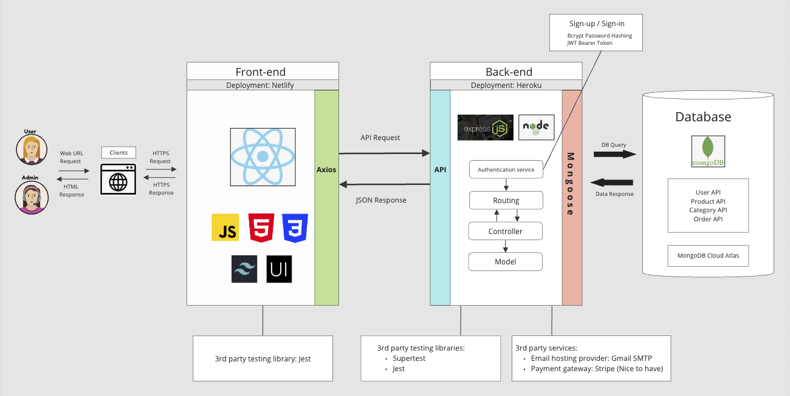

## T3A2 Full Stack App

# Sakura Pantry - Japanese Online Grocery Store

## Resources

- [Production site](https://www.google.com.au/)
- [Back-end repo](https://www.google.com.au/)
- [Front-end repo](https://www.google.com.au/)
- [Documentation repo](https://www.google.com.au/)
- [Trello board](https://trello.com/b/TE5Q9ZYj/t3a2-%F0%9F%8C%B8sakura-pantry)

## Contributors

- [Mana Misumi](https://github.com/Mana12011207)
- [Irene Nguyen](https://github.com/irenenguyen1017)
- [Ellen Pham](https://github.com/ellenpham)

## Website description

### Purpose

We were approached by the owner of Sakura Company, a Japanese food wholesaler, to create an online store for Japanese food products.

The web app serves three main purposes:

- To promote and increase access to Japanese food.
- To provide a service to the Japanese community in Australia and to those who love Japanese food products.
- To contribute to business and sales growth for the client, Sakura Company.

#### Problem

Prior to having the website, the primary means of obtaining Japanese food was through Japanese supermarkets, mainly located in central areas. This posed geographical constraints for those living in the suburbs. Moreover, limited store numbers and early closing times, often by 5pm, made it challenging for full-time workers to visit. Setting up a physical shop also presented a significant hurdle for Sakura Company, especially with rising rents due to recent unforeseen inflation.

#### Solution

The launch of Sakura Pantry is envisioned to address these challenges. Sakura Pantry is an easy-to-use platform for purchasing Japanese food products, accessible to both city dwellers and those in the suburbs, operating 24/7. Unrestricted by the number of shops or closing times, it offers the convenience of online shopping, catering to the busy full-time workforce. By avoiding the need for physical shops, it provides a more cost-efficient means for Sakura Company to offer Japanese food products. In doing so, Sakura Pantry introduces a modern solution to access Japanese food ingredients in response to contemporary demands.

### Target Audience

The app targets shoppers across Australia who are looking for unique and quality Japanese food products, including:

- Japanese people residing in Australia
- Japanese food products lovers

## Application Architecture Diagram

## User Stories 

Working in progress...

## Functionality/Features

The MVP includes two parts: the static website and the admin dashboard. The overall function of the website is to operate as an online store for selling Japanese food products.

### Features

- User authentication and authorisation (Register and Login/Logout)
- Sign-up confirmation via email
- Saved login details
- Site navigation
- Product search by name and by categories
- Product details view
- Showcase of new arrivals and featured products
- Shopping cart checkout
- Calculation for different delivery options
- Billing services
- Order confirmation via email
- Contact form
- User account view
- Admin dashboard:
  - User management
  - Product management
  - Order management (nice to have)

### Functionality

#### Users

- Website visitors without authentication can view products.
- Website visitors can add products to cart and will be prompted to register or log in if they wish to proceed to payment.
- Users with authentication can perform CRUD operations on personal account information.
- Users with authentication can perform CRUD operations on product orders.
- Users with authentication can perform CRUD operations on billing and delivery information.

#### Admins

- Admins can perform CRUD operations on users' information.
- Admins can perform CRUD operations on products.
- Admins can perform CRUD operations on product categories.
- A nice-to-have functionality: Admins can have the following operations on product orders, including search orders, view orders, edit orders and track orders.

## Sitemap

## Tech Stack

The core tech stack is MERN stack.

- Application:
  - Back-end API: NodeJS, ExpressJS, Mongoose
  - Front-end: HTML, CSS, JavaScript, ReactJS, Axios, Tailwind, NextUI
- Database:
  - MongoDB, MongoDB Atlas
- Testing:
  - Jest, Supertest
- Deployment:
  - Back-end API: Heroku
  - Front-end: Netlify
- DevOps:
  - Git
  - GitHub
  - VS Code
- Project Management:
  - Trello
  - Discord
  - Skype
- Design Tools:
  - Draw.io
  - Miro

## Tasks planning and tracking

View the description of the way tasks are allocated and tracked in the project [here](./task_tracking.md).

Link to project management tool [Trello](https://trello.com/b/TE5Q9ZYj/t3a2-%F0%9F%8C%B8sakura-pantry).
