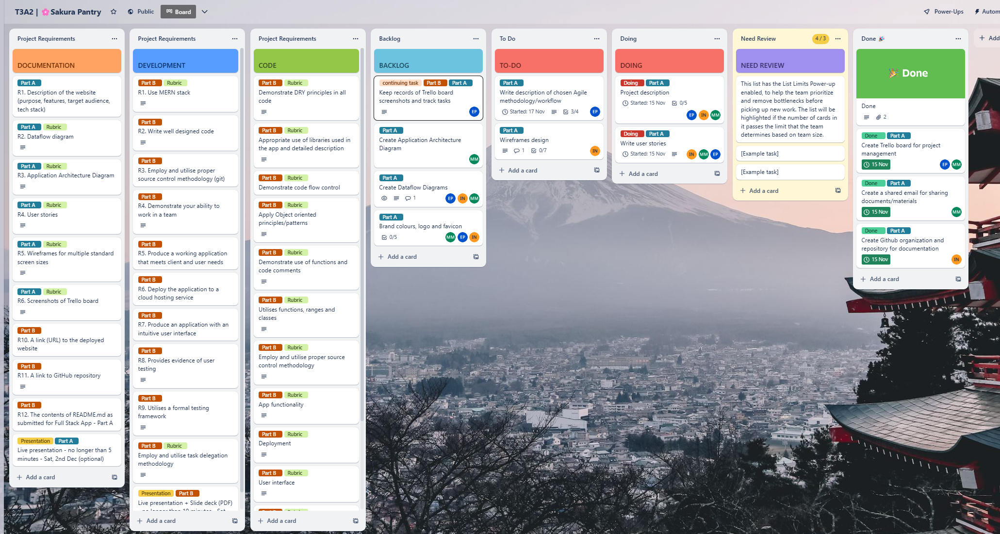
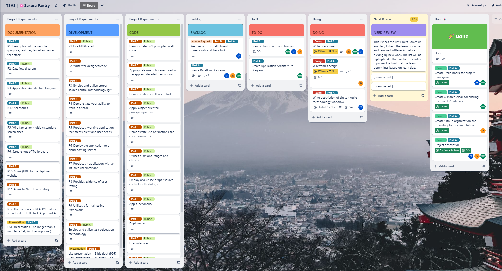
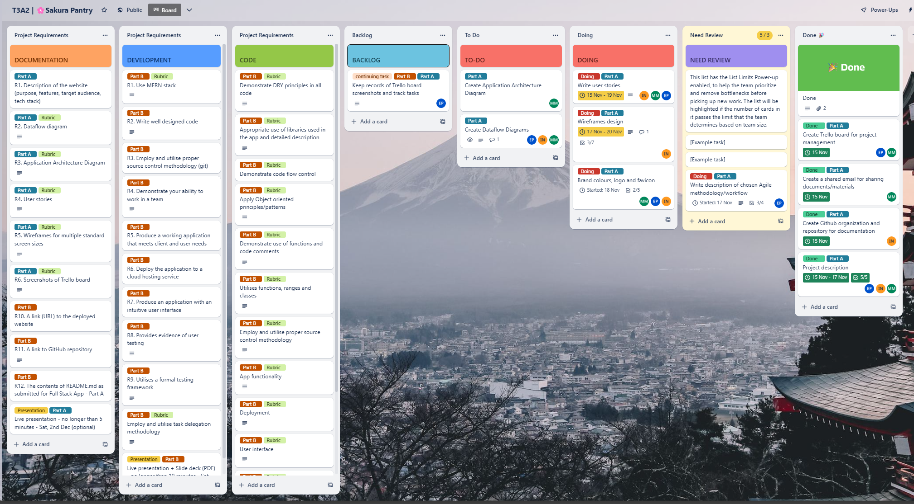
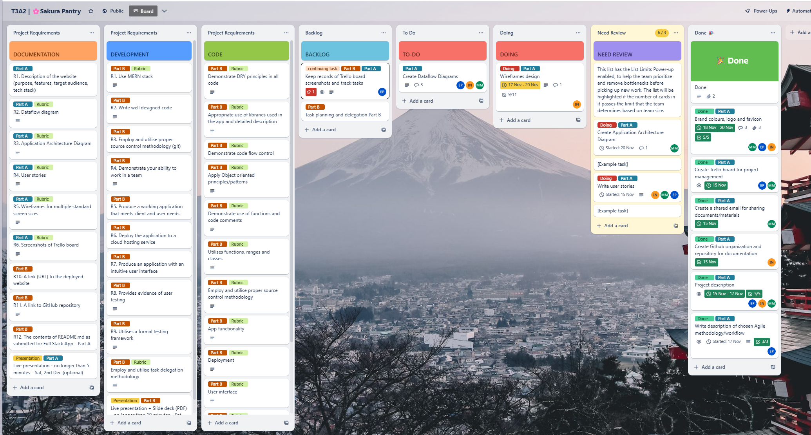
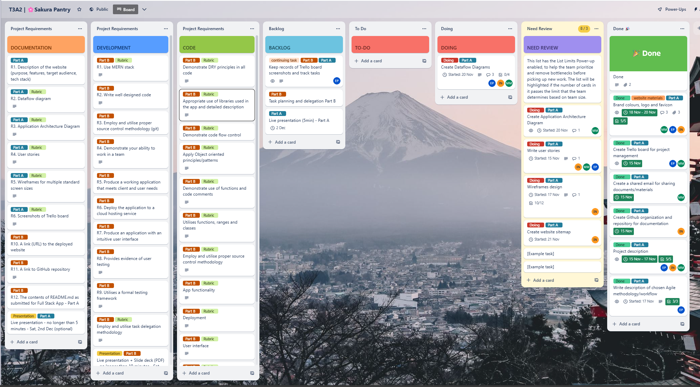
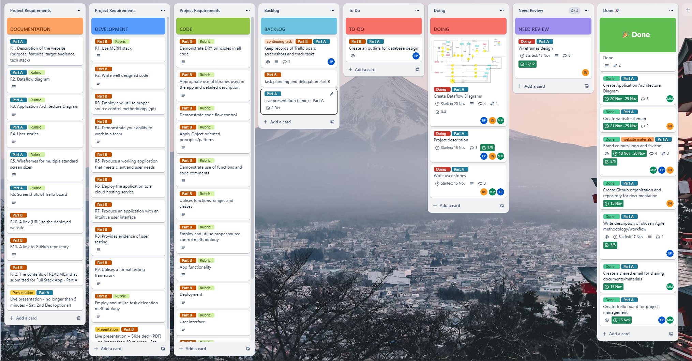

# Project Management and Task Delegation

## Workflow and Agile methodology

- For source control, we follow the Git Feature Branch Workflow. For every major task or app feature, each member creates a branch to work on their own delegated task or feature, when a task or feature is done, a pull request is created and it must be reviewed and approved by at least one member before being merged into main branch. Comments are added if our work needs to be modified together with a request for changes before a new pull request is made.

- In this project, we have chosen Kanban as the main framework for implementing Agile methodology. We focus on team collaboration, continuous delivery and continuous improvement. To achieve that, we use a combination of Kanban and Scrum methodology.

  - For continuous improvement, we use Scrum for sprint planning, daily stand-ups, sprint review and retrospective. Every end of a sprint, we have a meeting to review what we have achieved, what needs to be improved for the next sprint and what set of tasks we will be working on in the following sprint. We also have daily stand-ups via Discord channel for updating work progress. Communication is key when working with GitHub, we make sure to notify others when a branch is created for new task/feature and a new pull request is made.

  - For continuous delivery, we use Kanban. Kanban emphasizes visualizing tasks and feedback, real-time communicating and maximizing efficiency. There is no time constraint in Kanban, instead, the approach encourages to get things done in the shortest time within a set sprint, this allows the team to respond to changes faster, hence, optimizing workflow. If there is an issue, it needs to be raised in the task card or via Discord channel, so the other members can participate in resolving the problem and quickly move on to the next task.

  - Tasks are broken down from biggest objectives (initiatives/requirements) to the smallest details (user stories), so that they are visible, manageable and achievable.

**Part B task planning and delegation will be explained more here.....**

## Kanban board

We use Trello as our project management tool, please check out [Trello board](https://trello.com/b/TE5Q9ZYj/t3a2-%F0%9F%8C%B8sakura-pantry).

Below is the structure of our Kanban board with columns or lanes that represent different stages of work progress:

**Project requirements**

There are three columns for listing the criterion of project requirements, categorized into Documentation, Development, Code and Presentation. The columns are not subject to changes, they are kept for reference purposes and will only be screenshotted once.

**Backlog**

These are tasks that we want to do but not ready to work on. This is the staging area, where we should sort out all specifications and design relating to the task.

**Source Code**

This column is used for coding tasks only. It will be useful when app features are broken down into smaller tasks.

**To-Do**

Once all specifications are sorted out, a task will be moved from **Backlog** to **To-Do**. Here we will discuss and delegate tasks to each member. Tasks in **To-Do** are prioritized and need to be done as soon as possible.

**Doing**

Tasks under this column are things that we are working on, a start date is set when the task gets started and an end date for when the task is finished.

**Need Review**

Once a member is done with a task, they must move to **Need Review** column for other member to review before merging into main branch.

**Testing**

This column is used for code testing related tasks.

**Done**

This column is used for tasks that are completed, reviewed and ready to deliver to production.

## Tasks description

There are three main tasks in the development process:

- Stage 1: Initial Design and Planning
- Stage 2: Coding and Testing
- Stage 3: Documentation

See the below screenshots of tasks tracking on Trello for the Stage 1:

For Stage 1, we set one week as one sprint. We have decided to start a new sprint on Tuesdays.

### Sprint 1

**Day 1 and Day 2**: Create an outline of project description. Create a project management plan. Discuss workflow and task delegation for sprint 1. Create GitHub organization and a repository for project documentation (Part A). Starting on R1, R4, R5, R6.

**Day 3**: Complete R1-Project Description. Discuss user stories and brand design.

**Day 3**: Complete R1-Project Description. Discuss user stories and brand design.

**Day 4**: Start working on colour scheme and brand design for the website. Complete the description for chosen planning methodology (Part A R6). Discuss more on user stories, wireframes and dataflow diagrams.

**Day 5 and Day 6**: Complete brand design and decide on colour scheme. Still working on refining user stories, wireframes. Reviewing Application Architecture Diagram.

**Day 7**: End of sprint 1. All tasks have been planned out. A drafted version of R3, R4, R5 have been completed, discussed and reviewed among team members. The next set of tasks for sprint 2 will focus on the refinement of R3, R4, R5 before publishing to README.md. Discuss the multiple diagrams approach for dataflow diagrams, tasks have been delegated for completing R2 in the next sprint.

### Sprint 2

**Day 1 and Day 2**: Start of sprint 2. Complete website sitemap and Application Architecture Diagram (R3). Discuss on MVP approach to decide on keeping basic features/functionality that are achievable within the project scope. Working on adjustments for R1, R4 to align with changes of features/functionality. Still working on refining wireframes (R5). Discuss a new approach on Dataflow Diagrams (R2).

